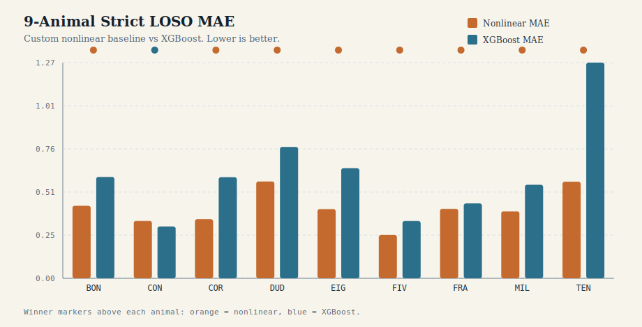
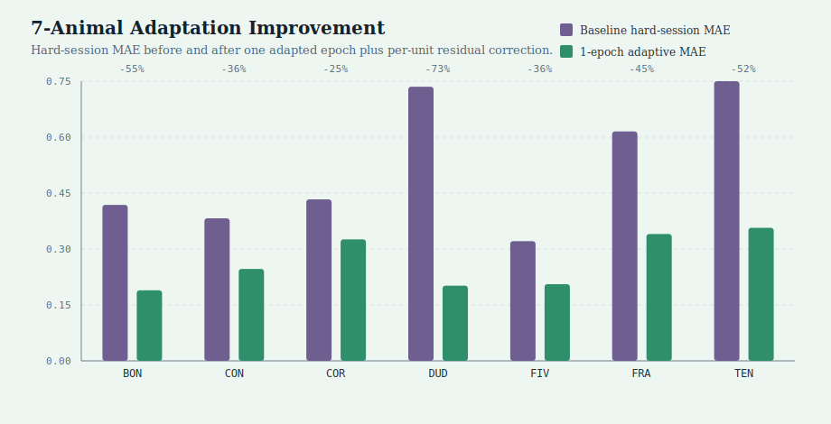

# Finley

Cross-session neural firing-rate prediction on CRCNS HC-6 data.

This project turns nested HC-6 MATLAB session files into model-ready tables, benchmarks cross-session generalization, and studies how a small amount of within-session calibration data reduces held-out error.

Detailed experimental notes live in [PROJECT_NARRATIVE.md](PROJECT_NARRATIVE.md).

## Problem

Predict per-cell firing rate during `run` epochs using movement, population, and cell-context features, while evaluating on held-out recording sessions rather than random row splits.

The main technical question is not just "which regressor fits the table best?" but "what kind of error remains after strict cross-session evaluation, and how much of it is session-specific?"

## What This Repo Contains

- HC-6 file inventory and session-loading utilities under `src/finley/data`
- session summarization and table export scripts for nested MATLAB structures
- run-cell modeling table construction for `(session, epoch, tetrode, cell)` rows
- a pure-Python nonlinear forest-style baseline
- comparison baselines including ridge and XGBoost
- hard-session residual diagnostics and session-adaptation experiments

## Main Result

Using leave-one-session-out evaluation with `movement_summaries`, `population_context`, and `cell_metadata` across 9 animals:

| Animal | Custom nonlinear LOSO | XGBoost LOSO | Takeaway |
| --- | --- | --- | --- |
| Bon | MAE `0.4265`, RMSE `0.5764` | MAE `0.5960`, RMSE `0.7520` | custom model is much better |
| Con | MAE `0.3370`, RMSE `0.4848` | MAE `0.3049`, RMSE `0.4479` | XGBoost is better |
| Cor | MAE `0.3474`, RMSE `0.4500` | MAE `0.5945`, RMSE `0.7296` | custom model is much better |
| Dud | MAE `0.5689`, RMSE `0.7665` | MAE `0.7723`, RMSE `0.9358` | custom model is better |
| Eig | MAE `0.4068`, RMSE `0.5692` | MAE `0.6470`, RMSE `0.7952` | custom model is much better |
| Fiv | MAE `0.2543`, RMSE `0.3078` | MAE `0.3366`, RMSE `0.4145` | custom model is better |
| Fra | MAE `0.4082`, RMSE `0.5200` | MAE `0.4407`, RMSE `0.5461` | custom model is better |
| Mil | MAE `0.3937`, RMSE `0.5003` | MAE `0.5502`, RMSE `0.6740` | custom model is better |
| Ten | MAE `0.5678`, RMSE `0.7517` | MAE `1.2682`, RMSE `1.4335` | custom model is much better |

Across the 9-animal sweep, the custom nonlinear model beat XGBoost on `8/9` animals. `Con` is the exception, which is still useful: the repo shows a strong default model, but it also keeps a real standard-library counterexample instead of pretending one approach wins everywhere.



## Adaptation Result

On the hardest held-out sessions, adding one labeled epoch from the held-out session and applying a per-unit residual correction substantially reduces error:

| Animal | Hard-session baseline mean MAE | 1-epoch adaptive MAE | Change |
| --- | --- | --- | --- |
| Bon | `0.4191` | `0.1897` | `-54.7%` |
| Con | `0.3831` | `0.2470` | `-35.5%` |
| Cor | `0.4341` | `0.3265` | `-24.8%` |
| Dud | `0.7367` | `0.2020` | `-72.6%` |
| Fiv | `0.3217` | `0.2061` | `-35.9%` |
| Fra | `0.6165` | `0.3410` | `-44.7%` |
| Ten | `0.7516` | `0.3576` | `-52.4%` |

This pattern now transfers across 7 animals tested in adaptation mode. The remaining cross-session gap is therefore not just a global session offset problem; a substantial part of it is unit-level calibration error that becomes learnable with modest within-session supervision.



## Diagnostic Takeaways

- strict cross-session evaluation is materially harder than single held-out-session checks
- the same small set of units reappears in the worst residuals on hard sessions
- sparse one-hot unit identity features are not a good low-data adaptation mechanism here
- residual correction learned from adapted epochs is much lower variance and works substantially better
- pooling more adaptation epochs is not always better; the calibration source matters
- the 9-animal benchmark makes the main ranking much more credible: the custom nonlinear model is the stronger default overall, not just on one animal
- the 7-animal adaptation sweep shows that the calibration story is also not confined to one or two hand-picked animals

## Reproduce

Create a Python 3.10+ environment and install the package:

```bash
python -m pip install -e ".[dev]"
```

If you want the optional benchmark dependencies too:

```bash
python -m pip install -e ".[bench]"
```

Copy the example config and point it at your HC-6 extraction root:

```bash
cp configs/hc6.local.example.json configs/hc6.local.json
```

Build a run-cell model table:

```bash
PYTHONPATH=src python scripts/build_model_table.py --config configs/hc6.local.json --animal Bon
```

Run the main nonlinear benchmark:

```bash
PYTHONPATH=src python scripts/train_run_cell_nonlinear.py \
  --input data/processed/bon_run_cell_model_table.csv \
  --leave-one-session-out \
  --target log_firing_rate_hz \
  --feature-groups movement_summaries population_context cell_metadata
```

Run the XGBoost comparison:

```bash
PYTHONPATH=src python scripts/train_run_cell_xgboost.py \
  --input data/processed/bon_run_cell_model_table.csv \
  --leave-one-session-out \
  --target log_firing_rate_hz \
  --feature-groups movement_summaries population_context cell_metadata
```

Run the session-adaptation experiment:

```bash
PYTHONPATH=src python scripts/run_session_adaptation_experiment.py \
  --input data/processed/bon_run_cell_model_table.csv \
  --output artifacts/bon_adaptation.json \
  --sessions 6 7 9 \
  --adaptation-epochs 0 1 2 \
  --target log_firing_rate_hz \
  --feature-groups movement_summaries population_context cell_metadata
```

## Data Note

This repository does not redistribute CRCNS HC-6 data. It assumes you already have authorized access to the extracted dataset and can point the local config at that root.

Full generated result artifacts live on the `portfolio-results` branch. This branch keeps only compact summary tables and lightweight figures.

## Project Layout

```text
configs/               example local dataset config
scripts/               runnable data-processing and experiment entrypoints
src/finley/data/       dataset loading, inventory, and session parsing
src/finley/models/     baseline and nonlinear model code
src/finley/analysis/   diagnostics and adaptation helpers
tests/                 unit tests
artifacts/             local experiment outputs (ignored by default)
```

## Why This Is In My Portfolio

This repo shows end-to-end applied ML work rather than only model training:

- data engineering on irregular scientific source files
- reproducible evaluation design under session shift
- careful baseline comparison instead of benchmark cherry-picking
- error analysis that led to a concrete adaptive fix
